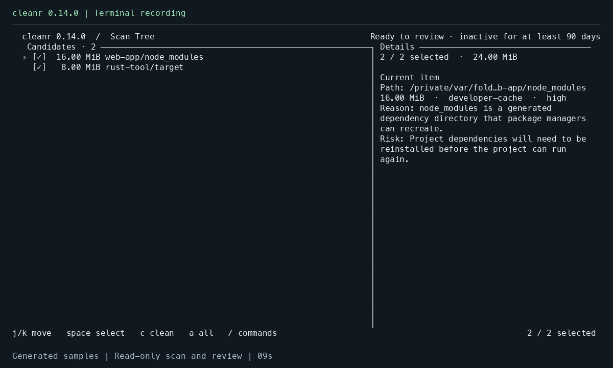

<div align="center">
  <h1>Cleanr</h1>
  <p><strong>AI 友好的磁盘清理，安全优先。</strong></p>
  <p>
    <a href="https://drl990114.github.io/Cleanr/zh-Hans/">完整文档</a> ·
    <a href="https://github.com/drl990114/Cleanr/releases">下载</a> ·
    <a href="https://github.com/drl990114/Cleanr/discussions">讨论区</a>
  </p>
  <p>
    <a href="https://github.com/drl990114/Cleanr/actions/workflows/ci.yml"></a>
    <a href="https://www.npmjs.com/package/cleanr-cli"></a>
    <a href="../../LICENSE"></a>
  </p>
  <p><a href="../en/README.md">English</a> · <a href="../../README.md">仓库 README</a> · <a href="../../CONTRIBUTING.md">贡献指南</a></p>
</div>

Cleanr 是一款 AI 友好的跨平台磁盘清理工具。它提供结构化的只读分析，让 AI Agent
能够解释清理候选项，帮助你准备可审阅的计划；也可以直接在终端中查看和选择。

覆盖应用与浏览器缓存、日志、临时文件、下载文件，以及 `node_modules`、Rust `target`、
包管理器缓存等开发产物。每个候选项都有匹配原因和风险说明；由你决定哪些移入系统
回收站，并保留本地恢复记录。

**安全优先。** 分析只读，默认在清理前确认；每项移动前都会复核所选路径与文件状态。
Agent 委托执行时，还会将已审阅计划与重新扫描的结果核对。条目进入系统回收站，
并保留本地记录以支持尽力恢复。详见
[安全检查与恢复限制](https://drl990114.github.io/Cleanr/zh-Hans/docs/safety-and-recovery)。

由你选择要审阅的目录或已知清理位置。各平台覆盖不同，请看
[扫描方式](https://drl990114.github.io/Cleanr/zh-Hans/docs/using-cleanr)与
[支持与验证矩阵](https://drl990114.github.io/Cleanr/zh-Hans/docs/support-matrix)。

## 首次扫描演示



**v0.14.0 · macOS Apple Silicon。** 使用生成的示例项目，只读扫描、查看 Review
并浏览候选项，没有执行清理或恢复。
[观看 34 秒演示](https://drl990114.github.io/Cleanr/media/cleanr-first-scan.mp4)
· [操作说明](https://drl990114.github.io/Cleanr/zh-Hans/docs/demo/)。

## 安装

使用 Node.js 18 或更新版本：

```bash
npm install --global cleanr-cli
cleanr --version
```

也可以使用 Rust 1.98 或更新版本执行 `cargo install cleanr-cli`，或从
[GitHub Releases](https://github.com/drl990114/Cleanr/releases) 下载原生二进制。
[安装、升级、回退与卸载](https://drl990114.github.io/Cleanr/zh-Hans/docs/quick-start)
说明了系统和 CPU 架构的选择方式。

## 选择第一次审阅方式

### 配合 AI Agent

安装可选的跨 Agent Skill：

```bash
npx skills add drl990114/cleanr@cleanr-review-disk-cleanup -g
```

可以这样提问：“用 Cleanr 审阅应用缓存和临时文件。汇总候选项、原因与风险，等我选择后再继续。”
Skill 只会在 CLI 缺失时安装它。底层只读入口为：

```bash
cleanr analyze --global \
  --global-kind app-caches \
  --global-kind temp-files
```

Cleanr 本身不会上传扫描路径或报告。**运行在本机的 Agent 仍可能把工具输出发送给
云端模型。** 交给 Agent 之前应确认其数据策略；希望不经过 AI 服务时，可直接使用 TUI。
详见[证据与隐私](https://drl990114.github.io/Cleanr/zh-Hans/docs/evidence-and-privacy)。

### 直接使用终端

```bash
cleanr /path/to/project
```

将路径替换为一个真实项目目录。按 `s` 扫描、`r` 审阅、`?` 查看帮助、`q` 退出。
第一次体验无需清理。审阅默认显示候选目录树中最新观测修改时间至少达到 **90 天**的
条目。空结果可能来自文件较新、路径被排除或没有匹配规则，不代表整台电脑已经干净。

看过候选项的原因和风险后，可以用 `space` 调整选择、`c` 打开清理确认框。
`/restore` 打开清理历史。详见[完整入门流程](https://drl990114.github.io/Cleanr/zh-Hans/docs/quick-start)。

## 能做什么

- 展示候选原因、大小、置信度和风险；依据可信规则和观测修改年龄进行保守选择。
- 执行前校验、重叠目标检查、系统回收站，以及本地清理和恢复清单。
- 英文与简体中文界面、声明式规则插件，以及 macOS、Linux、Windows 原生包。
- 带版本的 `analyze` JSON 报告，以及用于用户审阅并明确授权计划的独立、带摘要校验
  的 `clean` 命令。

**回收站是可恢复存储，不等于立即释放空间。** 移入后，文件通常仍然占用磁盘。
候选大小和已移动字节数不等于实测的可用空间增量。清空回收站是用户的另一个决定，
也会使 Cleanr 失去恢复来源。恢复尽力而为，不会覆盖已经存在的路径。

`--authorized-by-user` 表示调用方声明已经取得用户授权，Cleanr 无法独立确认是谁
给出了授权。摘要与重扫校验保护通过 Cleanr 命令执行的已审阅计划，但不是约束具有
其他文件操作工具的 Agent 的操作系统沙箱。

## 版本和帮助

分类筛选、跨筛选累积选择和 `Shift+A` 全局选择适用于 **0.15.0 及后续版本**。
0.15.0 同时引入 `cleanr.restore.v2` 恢复记录，回退版本前请阅读兼容性说明。
请结合 `cleanr --version` 和[更新记录](../../CHANGELOG.md)阅读。

- [安全与恢复](https://drl990114.github.io/Cleanr/zh-Hans/docs/safety-and-recovery)
- [故障排查](https://drl990114.github.io/Cleanr/zh-Hans/docs/troubleshooting)
- [支持与反馈](../../SUPPORT.md) · [安全问题报告](../../SECURITY.md)
- [发布准备与平台验证](https://drl990114.github.io/Cleanr/zh-Hans/docs/support-matrix)

## 致谢与许可证

Cleanr 包含改编自 [Byron/dua-cli](https://github.com/Byron/dua-cli) 的代码，原项目由
Sebastian Thiel 及贡献者以 MIT 许可证发布。Cleanr 使用 [MIT License](../../LICENSE)。
